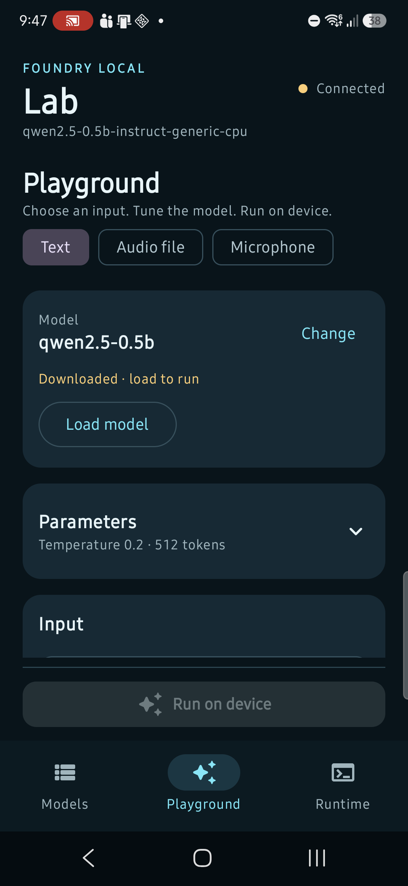
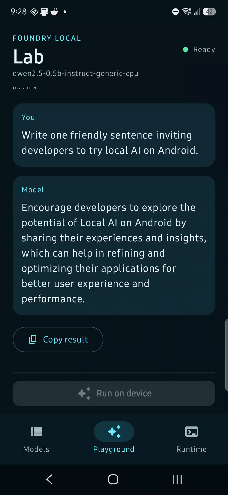
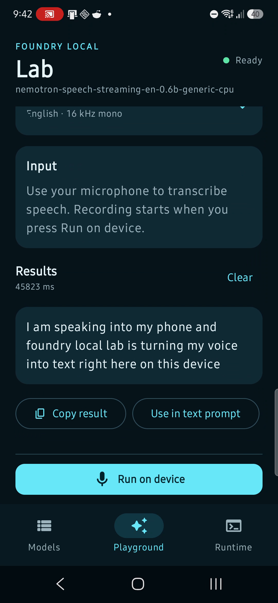

# Foundry Local Lab

Foundry Local Lab is a Jetpack Compose workbench for exploring the public Foundry Local Android SDK
through the service app. It brings model management, text and speech experiments, and runtime
diagnostics into one sample. It is IPC-only and does not include an inference engine or service
implementation.

## Workspaces

- **Models** searches and filters the live catalog, then downloads, loads, switches, unloads, or
  removes the selected model. A fresh connection prefers a runnable cached model when available.
- **Playground** combines Text, Audio file, and Microphone modes. Each follows the same model
  readiness, expandable parameters, input, run/stop, and results layout. A searchable model picker
  shows models compatible with the selected mode without leaving Playground.
- **Runtime** shows API, SDK, and service versions; compatibility; cache state; operation timings;
  capability status; and recent lifecycle events.

Text requests stream through the public chat API and support system instructions, temperature,
maximum output tokens, and optional top P, top K, stop sequences, presence penalty, and frequency
penalty. Blank advanced fields omit those options; supported controls and ranges depend on the model.

Audio file mode uses Whisper and supports complete or streaming transcription, with optional
language and temperature. Microphone mode uses a Nemotron streaming speech model with English,
16 kHz mono, 16-bit PCM input. Microphone capture begins only after permission and an explicit run
action; stop finalizes the transcript. Results can be copied, and a completed transcript can fill
the Text prompt before explicitly selecting and loading a chat model.

Changing input mode does not automatically download, load, or switch a model.

## Screenshots

Captured on a Samsung Galaxy S24 on 10 September 2026. These are actual app screens, not mockups.
The text and microphone result captures precede the small Parameters header clipping fix shown
in the Playground screenshot; they demonstrate real output from the same SDK integration.

| Playground | Text result | Microphone result |
|---|---|---|
|  |  |  |

## Requirements

- Android API 33 or newer; compile and target SDK 36
- JDK 17 or newer and the repository's Gradle wrapper
- A compatible [Foundry Local service app](https://play.google.com/store/apps/details?id=com.microsoft.foundrylocal.app)
- The public IPC SDK AAR from [release v0.1.6](https://github.com/microsoft/FoundryLocalAndroid/releases/tag/v0.1.6)
- Internet access for catalog access and model downloads; sufficient storage and memory for the model
- Notification permission when requested for foreground model downloads, and microphone permission
  for live transcription

## Setup and build

1. Download `foundry-local-ipc-sdk-0.1.6.aar` from the release above and retain the release's license
   and third-party notices.
2. Place it in `examples/ipc/FoundryLocalLab/libs/` without renaming it. Do not add an embedded AAR
   to this module. SDK binaries are ignored by Git and must not be committed.
3. Verify the AAR's SHA-256 against the published release checksum:

   ```text
   7dc74260d2dbd16c2c3c02bcd9de1d852bb89366f71a63ea9813fe764c2665c1
   ```

4. Set your Android SDK location using `ANDROID_HOME` or an untracked root `local.properties`.
5. From the repository root, run:

   ```bash
   ./gradlew :FoundryLocalLab:testDebugUnitTest :FoundryLocalLab:lintDebug :FoundryLocalLab:assembleDebug
   ```

   On Windows, use `./gradlew.bat` with the same tasks.

The APK is written to
`examples/ipc/FoundryLocalLab/build/outputs/apk/debug/FoundryLocalLab-debug.apk`.

For a first text run, connect to the service, choose a chat model, download it if needed, load it,
then open Playground, enter a prompt, and select **Run on device**. For speech, choose the appropriate
mode and a compatible model, download/load it explicitly, and choose a file or start microphone
capture. Model availability and performance depend on the device and service catalog.

## Integration notes

- All model lifecycle calls use the public `com.microsoft.foundrylocal.api` coroutine API. Before
  switching models, the sample cancels active work, finalizes microphone input, unloads the current
  model, and clears its client. Loading also unloads other active models reported by the service.
  This sample is intended for one active experiment at a time; do not run it alongside another client
  that needs its loaded model to remain active.
- The catalog alias is used for display and selection; lifecycle operations resolve canonical model
  identifiers so cached-model checks, loading, unloading, and removal address the same service record.
- Reconnection reacquires catalog, model, and client handles. Cancellation is preserved rather than
  reported as a successful inference.
- Chat history and transcripts are in memory. Selected audio files are copied to the app's private
  cache for SDK access; those copies may remain until Android clears the cache or the user clears
  app storage. Live microphone PCM is streamed in memory rather than saved as a recording.
- Runtime events include operation metadata, model identifiers, selected file names, and error
  messages. Review diagnostics before sharing them. Backup is disabled for this sample.

## Validation and limitations

The sample includes 17 JVM tests for model identity resolution, capability classification, and
parameter validation/request mapping. These are not instrumented UI or service-integration tests.

Manual device validation on 10 September 2026 used a Samsung Galaxy S24 and the public 0.1.6 IPC
SDK/service: Qwen 0.5B text generation and a Nemotron English microphone transcription completed.
Whisper file transcription is implemented but has not yet been exercised end-to-end in this sample.
The microphone UI shows the latest partial chunk while listening; stop requests the finalized
transcript. Long sessions, reconnection during capture, and a wider device matrix need further
validation. The sample is not a production-ready reference or a performance benchmark.

The SDK AAR is distributed under its own release license and notices; the repository's MIT license
covers the sample source. See the [integration guide](../../../docs/INTEGRATION_GUIDE.md) and
[API reference](../../../docs/API_REFERENCE.md) for the public contract.
